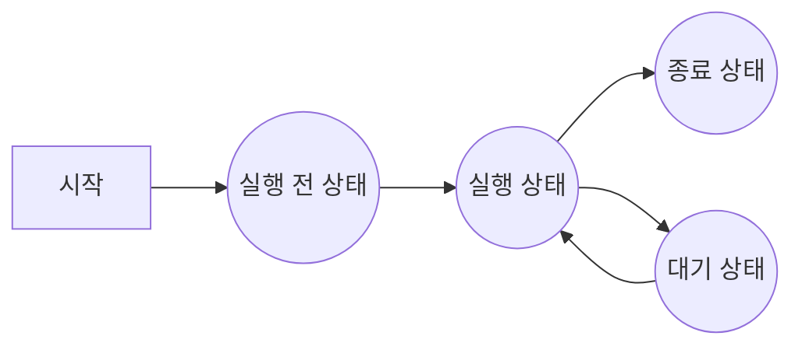

이 부분은 동시성 프로그래밍에 관한 책이다. 동시성(concurrency)와 비슷한 용어로 병렬성(parallelism)이 있으며 두 용어에 관해 함께 설명한다.

### 1.1 프로세스
동시성과 병렬성을 설명하기 이전에 프로세스(process)라는 용어 개념을 정의하겠다.

**프로세스**는 공간과 시간의 넓이를 모두 가지는 것이다. 즉 일부 시점에 일정한 공간을 가지고 있다는 점이다. 

프로세스는 어떤 카테고리를 나타내는 용어지만 여기서는 어떤 계산을 수행하는 추상적인 계산 실행 주체라는 계산과 관련된 프로세스만 가리킨다. 프로세스는 계산을 완료하기 위해 몇 가지 단계를 거친 뒤 최종적으로 계산을 멈춘다. 

이 부분에서는 프로세스를 다음과 같이 정의한다.

---
#### 정의: 프로세스

프로세스란 계산을 실행하는 주체를 가리키면 크게 다음 4 가지 상태를 변경하면서 계산을 진행한다.

1. 실행 전 상태: 계산을 실행하기 전의 상태. 실행 상태로 전이할 수 있다.
2. 실행 상태: 계산을 실행하고 있는 상태. 대기 상태 또는 계산 종료 상태로 전이할 수 있다.
3. 대기 상태: 계산을 일시적으로 정지한 상태. 실행 상태로 전이할 수 있다.
4. 종료 상태: 계산을 종료한 상태

다음은 프로세스의 상태 전이를 보여준다.

그림에서 알 수 있듯이 프로세스의 상태는 실행 전 상태에서 시작해 실행 상태, 대기 상태를 거쳐 종료 상태로 전이한다. 즉, 프로세스는 항상 실행 상태인 것이 아니라 실행 전 상태에서 종료 상태로 전이하는 도중에 대기 상태가 될 수도 있다. 대기 상태로 전이하는 이유는 다음 세 가지 이다.

1. 데이터가 도착하기를 기다린다. 계산이란 어떤 데이터에 대해 연산을 수행하는 것으로 데이터가 없거나 아직 도착하지 않았다면 계산을 할 수 없다. 따라서 계산 대상이 되는 데이터가 도착하기를 기다리는 동안 프로세스는 대기 상태가 된다.
2. 계산 리소스의 확보를 기다린다. 
3. 자발적으로 대기 상태로 진입한다. 자발적으로 대기 상태로 진입하는 이유로는 타이머(timer)등을 들 수 있다. 정기적으로 어떤 계산을 수행하지만 그 이외의 시간, 다시 말해 아무것도 할 필요가 없을 때 프로세스는 대기 상태가 된다. 이렇게 함으로서 계산 리소스를 불필요하게 점유하지 않아도 된다.

이렇게 프로세스는 실행 상태와 대기 상태로의 전이를 반복하면서 계산을 수행한다. 동시성과 병렬성은 이 실행 상태 및 대기 상태와 관련된 개념이다.

---

### 1.2 동시성

동시성의 2개 이상의 프로세스가 동시에 계산을 진행하는 상태를 나타내는 용어이다. 이 절에서는 동시에 계산을 진행하는 상태를 엄밀하게 정의한다.

- 그림 1-2 어떤 프로세스의 상태 전이와 계산 중 상태

이 프로세스는 시각 $t_{0}$ 에서 계산을 시작하고, $t_{1}$에서 계산을 종료한다. 프로세스가 실행 상태 또는 대기 상태에 있을 때 이 프로세스는 계산 중 상태에 있다고 정의한다. 즉, 프로세스가 계산 중 상태에 있다는 것은 계산을 수행하고 있는 상태라고 할 수 있다.

> [!note]
> 시각 $t$에서 여러 프로세스 $P_{0} . .P_{n}$이 계산 중 상태에 있다. 프로세스 $P_{0} . . P_{n}$은 시각 t에서 동시에 실행되고 있다. 

다음 그림은 임의의 2개 프로세스의 상태 전이를 시간 축에 따라 나타낸 것이다.

- **그림 1-3** 프로세스 A와 B의 실행 상태와 동시성

[그림]

위의 예에서 프로세스 A가 프로세스 B보다 먼저 실행 전 상태에서 실행 상태로 전이하며, 먼저 종료 상태로 전이한다. 따라서 앞의 정의에 따라 A,B 두 프로세스가 계산 중인 상태인 시간 $t|t_{0} <=  t <t_{0}$일 때 프로세스 A와 프로세스 B는 동시에 실행 중이라 할 수 있다.

일반적으로 동기 계산 또는 동시 처리 가능이라고 할 때는 어떤 시각 t에서 2개 이상 최대 n개 프로세스가 동시에 계산 중 상태를 유지할 수 있는 계산 모델 및 기반을 나타낸다.

OS 프로세스(OS process)와 스레드(thread)에 관해 간단히 살펴보자. 일반적으로 OS 프로세스는 커널(kernel)에서 본 프로세스를 의미하며, 스레드는 OS 프로세스 안에 포함된 프로세스로 분류된다. 많은 경우 애플리케이션을 기동하면 하나(또는 소수)의 OS 프로세스가 생성되고, 그 OS 프로세스 안에서 여러 스레드를 만든다.

- **그림 1-4** OS 프로세스와 스레드

위 그림과 같이 OS 프로세스는 OS가 각 프로세스에 독립된 가상 메모리 공간을 할당하고, 각 스레드는 소속된 OS 프로세스의 가상 메모리 공간과 시스템 자원을 공유한다. 여기서 시스템 리소스라 파일 디스크립터(file descriptor)등을 의미한다. 즉, 같은 OS프로세스 내의 스레드 사이에서는 같은 파일 디스크립터는 같은 파일을 나타내지만, 다른 OS 프로세스 사이에서는 같은 파일 디스크립터라도 다른 파일을 가리킨다.

> [!TIP] 파일 디스크립터는 정수값으로 표현한다. 즉, 프로세스는 A의 10라는 파일 디스크럽터와 프로세스 B의 10이라는 파일 디스크립터는 대부분 다른 파일을 가리킨다.  

실제 리눅스의 경우 스레드는 경량의 OS 프로세스로 구현되어 있으며 스케줄링할 때도 일반적인 프로세스와 마찬가지로 취급되기 때문에 구현 면에서 거의 차이가 없다고 할 수 있다.

어찌됬건 OS 프로세스나 스레드 모두 동시성을 구현하기 위한 메커니즘이라고 생각하면 된다.

### 1.3 병렬성

[[동시성과 병렬성#1.2 동시성]]은 2개 이상의 프로세스가 동시에 계산 중이 상태에 있다는 것이라고 했다. 반면 병령성은 같은 시각에서 여러 프로세스가 동시에 계산을 실행하는 상태를 의미한다. 즉, 여러 프로세스가 동시에 실행 중 일 때 이를 병렬로 작동하고 있다고 말한다. 따라서 프로세스가 병렬로 실행되는 상태는 다음과 같이 정의할 수 있다.

> [!정의]
> 시각 $t$에 여러 프로세스 $p_{0} ... p_{n}$이 실행되고 있다. $<===>$ 프로세스 $P_{0} ... P_{n}$은 시각 t에 병렬로 실행되고 있다.

다음은 그림은 프로세스 A와 B의 상태 전이를 시간 추 위에 나타낸 것으로 프로세스와 A와 B가 병렬 실행되는 시간을 표시한 것이다. 이 예에서는 $시각 t|t_{0}<=t_{1},t_{2}<=t<t_{3}$ 일 때 프로세스 A와 프로세스 B가 모두 실행되고 있으므로 시각 $t$에서 프로세스 A와 프로세스 B는 병렬 실행 중이라고 할 수 있다.

- **그림 1-5** 프로세스 A와 프로세스 B의 실행 상태와 병렬성
[그림]

이는 프로세스 관점에서 병렬성을 정의한 것이다. 컴퓨터 아키텍쳐, 즉 하드웨어에서 보면 병렬성은 **태스크 병렬성**, **데이터 병렬성**, **인스트럭션 레벨 병렬성**의 3종류로 나뉜다. 이 3종료의 병렬성을 간단히 살펴보자.

---

### 1.3.1 태스크 병렬성

**태스크 병렬성**(task parallelism)은 여러 태스크(이 책에서는 프로세스)가 동시에 실행되는 것을 의미한다. OS 계산 처리를 OS 프로세스 또는 스레드라 불리는 프로세스로 추상화하고 있으며, 태스크 병렬 처리에서는 이 OS 프로세스 또는 스레드를 여러 CPU를 이용해 동시에 작동시킨다.

태스크 병렬성은 스레드 병렬성(thread parallelism)이라 부르기도 한다.

### 1.3.2 데이터 병렬성

**데이터 병렬성**(data parallelism)은 데이터를 여러 개로 나눠서 병렬로 처리하는 방법이다. 예를 들어 $v_{1}=[1,2,3,4]$와 백터 $v_{2}=[5,6,7,8]$을 더하는 경우 한 단계씩 실행하면 다음과 같이 된다.

$v_{1}+v_{2}=[1+5,2+6,3+7,4+8]=[6,2+6,3+7,4+8]=[6,8,3+7,4+8]=[6,8,10,4+8]=[6,8,10,12]$
이것은 연산기가 하나밖에 없는 경우의 계산 방법(즉, 한 번에 1회의 계산만 실행할 수 있는 방법)이다. 만약 연산기가 4대라면 각 계산을 4대의 연산기에서 따로 계산하므로 보다 빠르게 실행할 수 있다. 이를 데이터 병렬 처리에서 **벡터 연산**이라고 부른다.

데이터 병렬성은 CPU가 제공하는 벡터 연산 명령 이외의 방법으로도 구현할 수 있다. 단, 이처럼 계산량이 적은 문제에 대해서는 스레드 생성이나 동기 처리를 위한 오버헤드가 크기 때문에 한 단계씩 계산하는 것보다 오히려 속도가 느려지므로 주의해야 한다.

#### 응답 속도와 처리량

계산 속도는 ***응답 속도***와 ***처리량***(throughput)이라는 두 가지 척도로 볼 수 있다. 

응답 속도: 계산을 시작해서 마칠 때까지의 시간을 나타낸다. 응답 속도를 나타내기 위해 소비 CPU 클록(clock)수나 소비 CPU 인스트럭션 수 등이 척도로 이용되었는데, 이는 모두 시간으로 바꿀 수 있다.

$응답 속도= \frac {소비 CPU 클록 수} {CPU 작동 클록 주파수}[s]$

$응답 속도= \frac {소비 CPU 인스트럭션 수 * CPI} {CPU 작동 클록 주파수}[s]$

위의 식에서 CPI는 Cycle Per Instruction의 약자이면 1 인스트럭션당 평균 CPU 사이클 소비량을 나타낸다. CPI 프로그램 종류에 따라 달라지므로 주의해야 한다. 최근의 CPU는 소비 전력을 억제하기 위해 작동 클록 주파수를 동적으로 변화시킬 수 있으므로 위 식의 CPU 작동 클록 주파수에는 프로그램 실행 시의 작동 클록 주파수를 대입해야 한다.

처리향이란 단위 시간당 실행 가능한 계산량을 나타내며 단위로는 [[MIPS]], [[FLOPS]]등을 이용한다.

---

### [[암달의 법칙]]

### 1.3.3 [[인스트럭션 레벨 병렬성]]

---

### 1.4 동시 처리와 병렬 처리의 필요성

지금까지 동시성과 병렬성에 관해 설명했다. 이 절에서는 병렬 처리와 동시 처리가 중요한 이유를 설명한다.

#### 1.4.1

(생략)

#### 1.4.2

(생략)